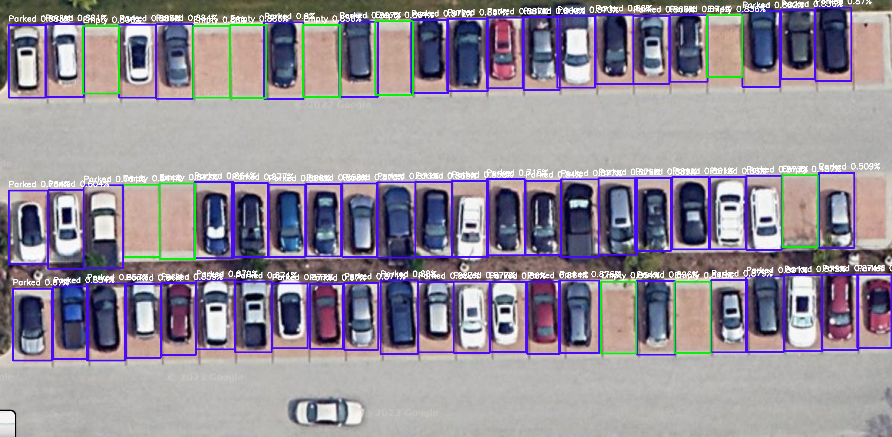

# Smart Parking Management (SPM) Project

## Project Overview
Smart Parking Management (SPM) aims to address urban parking challenges using a machine learning model that analyzes parking area images to identify vacant spots. Employing the advanced YOLO v8 algorithm, our system achieves high precision in real-time object detection, making it an essential tool for urban parking management.

## Features
- **High Precision Detection:** Utilizes YOLO v8 for real-time detection with a mean Average Precision at 50% (mAP50) of 0.891.
- **Robust Dataset:** Analyzes 393 images from Google Maps, focusing on a variety of parking scenarios.
- **User-Friendly Interface:** Features a simple interface for real-time parking availability using Streamlit.

## Demonstration
Here is a video demonstration of the parking detection in action:

https://github.com/BanisharifM/Smart-Parking-Management/assets/41099498/7e07154e-1f79-4b7e-a537-a293a6546e2b

And here's an example of detected parking spaces:

## Results
Our model effectively identifies and classifies parking spaces, providing real-time updates that help reduce urban parking-related stress and congestion.

## Future Work
- **Real-world Testing:** Plans to test and optimize the model under various urban conditions.
- **Expand Parking Space Diversity:** Aims to enhance the model's ability to recognize different types of parking spaces.

